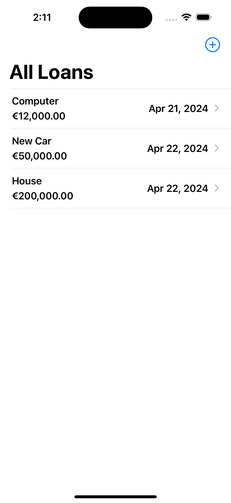
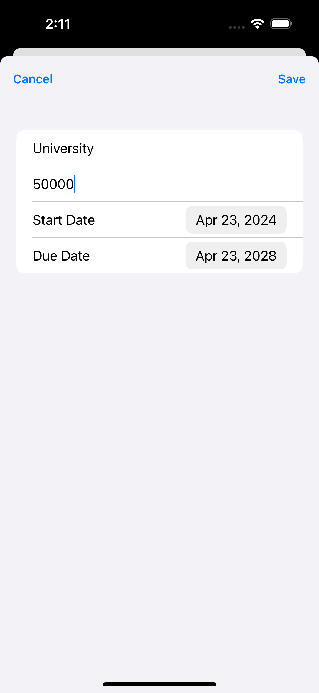
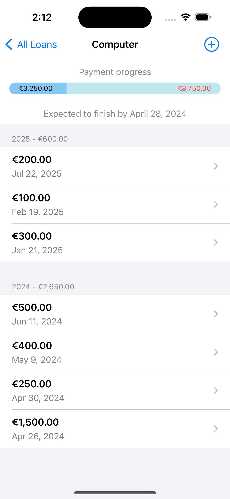

# Loan Tracker App

Simple Loan Tracker App to manage loans and payments sorted by date.

### Setup
This project was implemented using XCode 15.3 and iOS 17 deployment target.

## Summary

#### - ADVANCED APP DESIGN
The main goal to develop this simple app is demostrate the use of  SwifUI, CoreData and MVVM architecture to implement this solution.

#### - SWIFTUI USE
We will create a list of Loans with a plus button to add new ones and a detail view to show all payments related to selecte Loan.

#### - Core Data
We save all Loans and Payments using Core Data and we implemneted edit and delete features to the list view that reflects changes in the database.

# App screens

<table style="width:100%">
  <tr>
    <td></th>
    <td></th>
    <td></th>
  </tr>
</table>

### End
